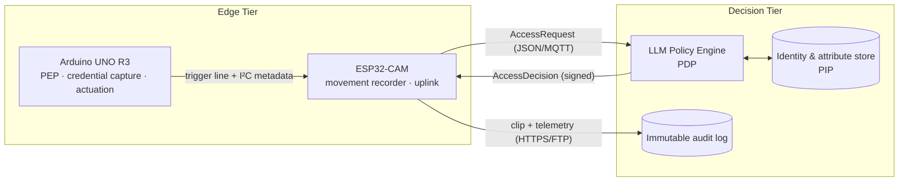
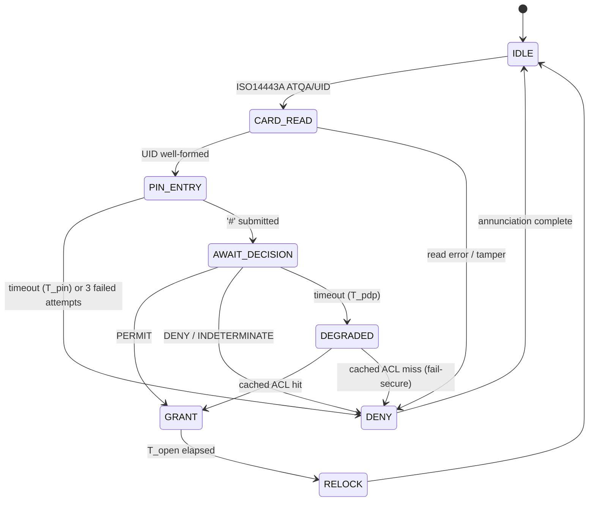

# Smart Gateway Arduino Hardware in Movement Attestation

*A bench-scale embedded testbed for smart-workplace physical access, combining circuit design and firmware development on the ESP32/Arduino platforms.*

---

## 1. Abstract

This repository contains the **edge tier** of a two-tier smart-workplace access control system. The system governs the physical movement of employees through a company's controlled portals (main entrance, floor doors, restricted laboratories) by combining conventional credential capture with continuous visual attestation of the transit event.

The architecture separates *decision* from *enforcement*, following the reference model established by NIST SP 800-162 for Attribute-Based Access Control (ABAC) [1] and the XACML functional decomposition [2]:

- The **Policy Decision Point (PDP)**, an LLM-mediated rule engine that evaluates natural-language organisational policy against structured request attributes.
- The **Policy Enforcement Point (PEP)**, the **Policy Information Point (PIP)** and the **movement recording subsystem**.
Concretely, this repository implements a **laboratory-scale mini gateway**: an Arduino UNO R3 node performing multi-factor credential capture (RFID + PIN) and electromechanical actuation, coupled to an ESP32-CAM node performing event-triggered motion recording, derived from the `ESP32-CAM_MJPEG2SD` firmware [3]. The credential-capture logic is inspired by the BanLinhKien RC522 door-lock reference project [4], which is extended here from a stand-alone hard-coded lock into a network-attached, policy-governed, auditable enforcement node.

> [!CAUTION]
> **Credential strength.** An RC522 UID is an *identifier*, not a *secret*: MIFARE Classic UIDs are trivially cloned, and the Crypto-1 cipher has been broken in the open literature since 2008 [5]. The PIN factor and the visual attestation exist precisely because the card carries no weight on its own. Any field deployment requires cryptographic card authentication (DESFire EV2/EV3 or equivalent).

---

## 2. System Context



The division of responsibility is deliberate and strict:

| Concern | Tier | Rationale |
|---|---|---|
| Credential acquisition (UID, PIN) | Edge | Requires physical proximity to the transducer |
| Liveness / movement evidence | Edge | Bandwidth-prohibitive to stream continuously |
| Identity resolution | Decision | Requires the authoritative employee directory |
| Policy evaluation | Decision | Rules are expressed in natural language and revised frequently |
| Actuation | Edge | Must remain deterministic and bounded in latency |
| Audit retention | Decision | Must be tamper-evident and outlive the device |

> [!IMPORTANT]
> The edge node **never** stores organisational policy. It holds only a short-lived *cached authorisation set*, bounded in size and TTL, used to sustain degraded operation during a network partition. On any cache miss the node fails **secure** when it denies.

---

## 3. Hardware Realisation

### 3.1 Bill of Materials

| Qty | Component | Role |
|---|---|---|
| 1 | Arduino UNO R3 (ATmega328P) | Enforcement node / credential controller |
| 1 | MFRC522 (RC522) 13.56 MHz reader | ISO/IEC 14443A credential capture |
| 1 | LCD 1602 with PCF8574 I²C backpack | Operator prompt and state display |
| 1 | 4×4 matrix membrane keypad | PIN entry (second authentication factor) |
| 1 | SG90 micro servo | Latch actuation (bench surrogate for a solenoid strike) |
| 2 | LED, red and green, with 220 Ω series resistors | Denial / grant annunciation |
| 1 | Passive buzzer | Audible denial and tamper alarm |
| 1 | ESP32-CAM (AI-Thinker, OV2640) + microSD | Movement recording and network uplink |
| 1 | Breadboard, jumper set, 5 V ≥ 2 A supply | Bench harness |

> [!WARNING]
> **Power distribution.** The servo's stall current and the ESP32-CAM's transmit bursts must not be drawn through the UNO's on-board regulator. Both are fed from the external 5 V rail with grounds commoned to the UNO. Omitting this is the single most common cause of spurious resets on this bench.

### 3.2 Pin Assignment — Arduino UNO R3

Derived from the reference wiring of [4] and retained for interoperability with that kit.

| Signal | UNO pin | Notes |
|---|---|---|
| RC522 `SDA/SS` | D10 | SPI slave select |
| RC522 `RST` | D9 | Module reset |
| RC522 `MOSI / MISO / SCK` | D11 / D12 / D13 | Hardware SPI |
| RC522 `3.3V`, `GND` | 3V3, GND | 3.3 V only — see caution below |
| Buzzer | D8 | Active-high |
| Green LED (grant) | D7 | |
| Red LED (deny) | D6 | |
| Keypad rows R1–R4 | D5, D4, D3, D2 | |
| Keypad columns C1–C3 | A3, A2, A1 | See pin-budget note below |
| Servo signal | A0 | Driven as a digital output |
| LCD `SDA` / `SCL` | A4 / A5 | Shared I²C bus |

> [!NOTE]
> **Pin budget.** The RC522 is **not 5 V tolerant**. Powering it from the UNO's 5 V rail, or driving its SPI lines at 5 V without series resistors, will destroy the module. The ATmega328P exhausts its I/O on this configuration. The reference design [4] declares only three keypad columns, so the fourth column of a 4×4 keypad (`A`, `B`, `C`, `D`) is physically present but unscanned — the device behaves as a 4×3 keypad. This project accepts that constraint rather than silently changing the reference wiring, and instead assigns the two soft keys the system needs (`*` = clear, `#` = submit) to the surviving columns. Reclaiming the fourth column requires either an I/O expander on the existing I²C bus (recommended: PCF8574 at a second address) or migration of the enforcement node to an MCU with a larger port map.

### 3.3 Inter-node Interface

Because no general-purpose pins remain, the UNO↔ESP32 link is carried on the **existing I²C bus**, with the ESP32 enrolled as a slave alongside the LCD backpack, plus one dedicated hard-wired trigger line.

| Line | UNO | ESP32-CAM | Purpose |
|---|---|---|---|
| `SDA` / `SCL` | A4 / A5 | GPIO 13 / GPIO 12 | Structured event metadata, decision return |
| `REC_TRIG` | (shared with buzzer gate) | GPIO 16 | Level-triggered recording request |
| `GND` | GND | GND | Common reference |

> [!WARNING]
> Level shifting is required: the ESP32 is a 3.3 V part. A bidirectional MOSFET level translator is used on `SDA`/`SCL`; the trigger line uses a resistive divider. GPIO 12 and 13 are only available because `ESP32-CAM_MJPEG2SD` is configured for **1-line SD (`SD_MMC` 1-bit) mode**, which releases the SDIO data lines. This is the stock configuration of that firmware [3].

---

## 4. Firmware Architecture

### 4.1 Node A — Enforcement Node (Arduino UNO)

A deterministic finite-state machine. No dynamic allocation, no blocking network I/O, bounded worst-case path from credential presentation to actuation.



Departures from the reference implementation [4]:

1. **The master UID and the PIN are no longer authorisation.** In [4], a UID match against a compile-time constant *is* the grant. Here, both factors are merely *evidence*: they are marshalled into an access request and the grant is issued only by the PDP. The firmware contains no employee credentials.
2. **PINs are never transmitted or logged in clear.** The keypad buffer is salted with a per-transaction nonce and hashed; only the digest leaves the node, and the plaintext buffer is zeroised on every state exit.
3. **The display masks input.** Retained from [4]: entered digits render as `*` on the 1602.
4. **Every transition emits an audit record**, including denials, timeouts and tamper events — a denial that is never recorded is indistinguishable from an attack that was never attempted.

### 4.2 Node B — Movement Recorder (ESP32-CAM)

Built on `ESP32-CAM_MJPEG2SD` [3], which supplies the frame pipeline, AVI muxing to SD, MJPEG/RTSP streaming, MQTT publication and time-stamped foldering. This project supplies a thin integration layer above it:

- **Event-triggered capture.** The recorder is driven by the external-GPIO trigger path already present in [3]: assertion of `REC_TRIG` by the enforcement node opens a clip. A configurable pre-roll (retained frame ring) and post-roll bracket the transit, so the clip contains the approach and the departure, not merely the latch event.
- **Secondary camera-side motion detection.** The frame-differencing detector of [3] — which compares successive downscaled greyscale bitmaps — runs continuously. A movement detection *without* a corresponding credential event is itself a reportable condition: it is the signature of tailgating, of an unbadged transit, or of a propped door.
- **Correlation.** Each clip is named and tagged with the transaction identifier received over I²C, so the video evidence and the audit record are joinable after the fact.
- **Uplink.** Access requests and decisions traverse MQTT; clips traverse HTTPS or FTP to the retention store, using the transports already implemented in [3].

### 4.3 Bring-up

> [!NOTE]
> **Prerequisites.** Arduino IDE ≥ 2.x or `arduino-cli`; ESP32 board support ≥ 2.0.x; libraries `MFRC522`, `LiquidCrystal_I2C`, `Keypad`, `Servo`; the upstream `ESP32-CAM_MJPEG2SD` sources [3].

1. **Wire and verify power** before connecting the RC522 — confirm 3.3 V at the module, and confirm the servo and camera are on the external rail.
2. **Flash the enforcement node.** Bring it up with the local PDP stub (`tools/pdp-stub`) so that the door logic can be exercised without the decision tier.
3. **Flash and provision the recorder.** On first boot the ESP32-CAM raises its own access point at `192.168.4.1`, where WiFi credentials, resolution, frame rate and motion sensitivity are configured [3].
4. **Verify the trigger path** — assert `REC_TRIG` and confirm a clip is written to SD with the expected pre-roll.
5. **Point the recorder at the real PDP** and confirm signature verification, including a deliberate negative test with a bad signature.

### 4.4 Movement Semantics

The system distinguishes three observable classes, only the first of which is a normal transit.

| Class | Credential event | Motion event | Interpretation |
|---|---|---|---|
| 1 — Attested transit | present | present | Nominal |
| 2 — Unattested motion | absent | present | Tailgating / propped door / intrusion |
| 3 — Unconsummated grant | present | absent | Credential probing, or a granted user who did not enter |

> [!IMPORTANT]
> Classes 2 and 3 are escalated to the decision tier as anomalies rather than being discarded at the edge. An access system that observes only successful transits is blind to precisely the events worth observing.

---

## 5. Project Structure

```
iot-hardware/
├── firmware/
│   ├── gateway-uno/          # Enforcement node: FSM, RC522, keypad, LCD, servo
│   └── recorder-esp32cam/    # Integration layer over ESP32-CAM_MJPEG2SD
├── hardware/
├── protocol/
├── docs/
└── tools/
```
---

## References

[1] V. C. Hu *et al.*, *Guide to Attribute Based Access Control (ABAC) Definition and Considerations*, NIST Special Publication 800-162, National Institute of Standards and Technology, 2014.

[2] OASIS, *eXtensible Access Control Markup Language (XACML) Version 3.0*, OASIS Standard, 2013.

[3] s60sc, *ESP32-CAM_MJPEG2SD* — ESP32/ESP32-S3 camera application recording MJPEG frames to SD as AVI, with motion detection, streaming, telemetry and MQTT. https://github.com/s60sc/ESP32-CAM_MJPEG2SD

[4] BanLinhKien, *BLKLab PRJ14 — RFID door lock with Arduino UNO R3*, Arduino learning-kit reference project. https://github.com/BanLinhKien/Arduino/blob/main/2_Bo_KIT_Hoc_Tap_Arduino_Uno_R3_RFID_BLK/BLKLab_PRJ14_Cach_Lam_Khoa_Cua_RFID_Bang_Arduino/BLKLab_PRJ14_Cach_Lam_Khoa_Cua_RFID_Bang_Arduino.ino

[5] F. D. Garcia *et al.*, "Dismantling MIFARE Classic," in *Proc. 13th European Symposium on Research in Computer Security (ESORICS)*, LNCS 5283, Springer, 2008, pp. 97–114.