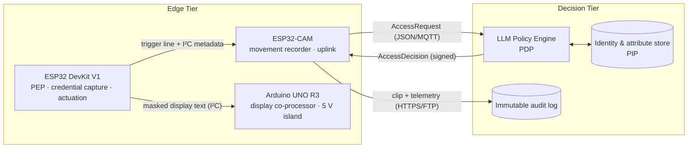
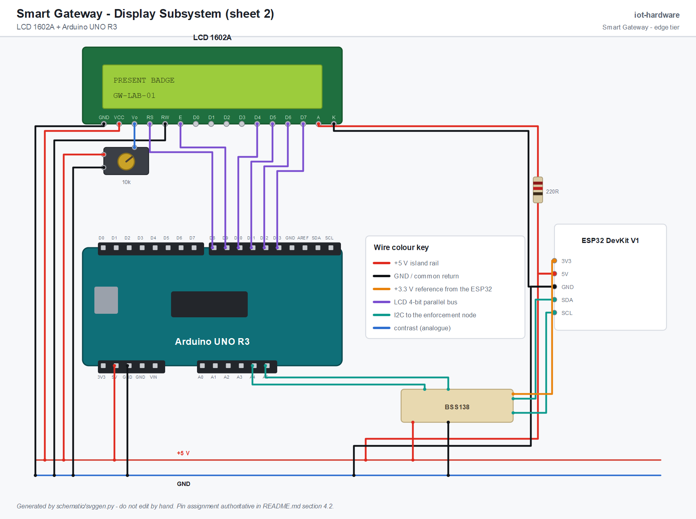
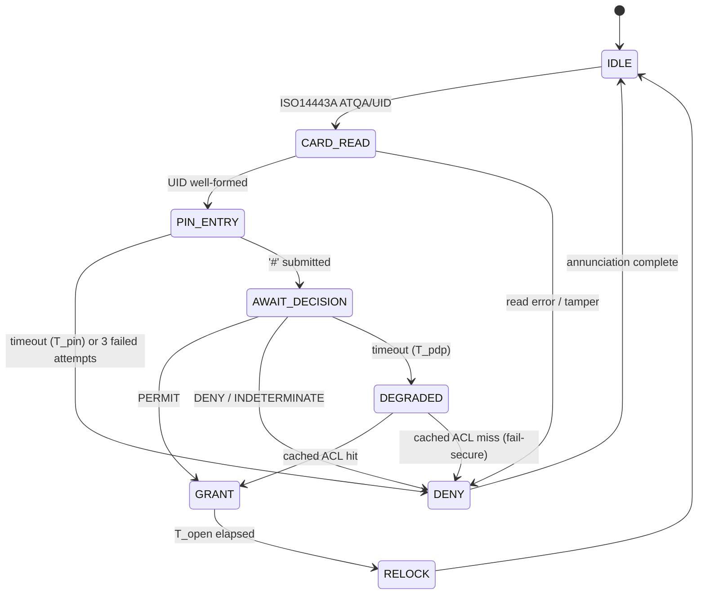

# Smart Gateway ESP32 Hardware in Movement Attestation
---

## 1. Abstract

This repository contains the **edge tier** of a two-tier smart-workplace access control system. The system governs the physical movement of employees through a company's controlled portals (main entrance, floor doors, restricted laboratories) by combining conventional credential capture with continuous visual attestation of the transit event.

The architecture separates *decision* from *enforcement*, following the reference model established by NIST SP 800-162 for Attribute-Based Access Control (ABAC) [1] and the XACML functional decomposition [2]:

- The **Policy Decision Point (PDP)**, an LLM-mediated rule engine that evaluates natural-language organisational policy against structured request attributes.
- The **Policy Enforcement Point (PEP)**, the **Policy Information Point (PIP)** and the **movement recording subsystem**.
Concretely, this repository implements a **laboratory-scale mini gateway**: an **ESP32 DevKit V1** node performing multi-factor credential capture (RFID + PIN) and electromechanical actuation, coupled to an ESP32-CAM node performing event-triggered motion recording, derived from the `ESP32-CAM_MJPEG2SD` firmware [3]. The RC522/LCD/servo wiring follows the ESP32 door-access reference of Robotique Site [6], with its companion video walkthrough [7]; the keypad, annunciator and PIN logic are carried over from the BanLinhKien RC522 door-lock kit project [4]. Both references are stand-alone hard-coded locks, and both are extended here into a single network-attached, policy-governed, auditable enforcement node.

> [!CAUTION]
> **Credential strength.** An RC522 UID is an *identifier*, not a *secret*: MIFARE Classic UIDs are trivially cloned, and the Crypto-1 cipher has been broken in the open literature since 2008 [5]. The PIN factor and the visual attestation exist precisely because the card carries no weight on its own. Any field deployment requires cryptographic card authentication (DESFire EV2/EV3 or equivalent).

---

## 2. Project Structure

```
iot-hardware/
├── firmware/
│   ├── gateway-esp32/                   # Enforcement node (FSM, RC522, keypad, servo)
│   ├── display-uno/                     # Display co-processor (I2C slave, 1602A in 4-bit)
│   └── esp32cam/                        # Integration layer over ESP32-CAM_MJPEG2SD
├── schematic/                           # EAGLE sheet + breadboard/schematic generator
├── protocol/
├── docs/
└── tools/
```
---

## 3. System Context



The division of responsibility is deliberate and strict:

| Concern | Tier | Rationale |
|---|---|---|
| Credential acquisition (UID, PIN) | Edge | Requires physical proximity to the transducer |
| Liveness / movement evidence | Edge | Bandwidth-prohibitive to stream continuously |
| Identity resolution | Decision | Requires the authoritative employee directory |
| Policy evaluation | Decision | Rules are expressed in natural language and revised frequently |
| Actuation | Edge | Must remain deterministic and bounded in latency |
| Audit retention | Decision | Must be tamper-evident and outlive the device |

> [!IMPORTANT]
> The edge node **never** stores organisational policy. It holds only a short-lived *cached authorisation set*, bounded in size and TTL, used to sustain degraded operation during a network partition. On any cache miss the node fails **secure** when it denies.

---

## 4. Hardware Realisation

### 4.1 Materials

| Qty | Component | Role |
|---|---|---|
| 1 | ESP32 DevKit V1 (ESP32-WROOM-32, 30-pin) | Enforcement node / credential controller |
| 1 | MFRC522 (RC522) 13.56 MHz reader | ISO/IEC 14443A credential capture |
| 1 | LCD 1602A, bare 16-way header (HD44780) | Operator prompt and state display |
| 1 | Arduino UNO R3 (ATmega328P) | Display co-processor — see §4.3 |
| 1 | 10 kΩ potentiometer | LCD contrast (`Vo`) |
| 1 | 220 Ω resistor | LCD backlight anode |
| 1 | 4×4 matrix membrane keypad | PIN entry (second authentication factor) |
| 4 | 10 kΩ resistors | Pull-ups for the keypad columns — see §4.2 |
| 1 | BSS138 bidirectional level translator (2-channel) | 5 V Arduino onto the 3.3 V I²C bus |
| 1 | SG90 micro servo | Latch actuation (bench surrogate for a solenoid strike) |
| 2 | LED, red and green, with 220 Ω series resistors | Denial / grant annunciation |
| 1 | Passive buzzer | Audible denial and tamper alarm |
| 1 | ESP32-CAM (AI-Thinker, OV2640) + microSD | Movement recording and network uplink |
| 1 | Breadboard, jumper set, 5 V ≥ 2 A supply | Bench harness |

> [!WARNING]
> **Power distribution.** The servo's stall current and the ESP32-CAM's transmit bursts must not be drawn through the DevKit's on-board regulator. Both are fed from the external 5 V rail with grounds commoned to the ESP32. Omitting this is the single most common cause of spurious resets on this bench.

### 4.2 Pin Assignment (ESP32 DevKit V1)

The RC522, LCD and servo assignments are taken verbatim from the Robotique Site ESP32 reference [6] and retained for interoperability with it. That reference carries no keypad and no annunciators; those are this project's own, placed on pins the reference leaves free.

The **Silkscreen** column is what is actually printed on the board, and it is not always `Dnn`. Wire against that column, not against the GPIO number.

| Signal | ESP32 GPIO | Silkscreen | Source | Notes |
|---|---|---|---|---|
| RC522 `SDA/SS` | GPIO 5 | `D5` | [6] | VSPI slave select |
| RC522 `RST` | GPIO 2 | `D2` | [6] | Module reset |
| RC522 `SCK / MOSI / MISO` | GPIO 18 / 23 / 19 | `D18` / `D23` / `D19` | [6] | Hardware VSPI |
| RC522 `3.3V`, `GND` | 3V3, GND | `3V3`, `GND` | [6] | Native 3.3 V — no translation |
| I²C `SDA` / `SCL` | GPIO 21 / GPIO 22 | `D21` / `D22` | [6] | Shared bus: display co-processor + recorder |
| Servo signal | GPIO 17 | **`TX2`** | [6] | LEDC-driven 50 Hz PWM |
| Keypad rows R1–R4 | GPIO 13, 14, 27, 26 | `D13`, `D14`, `D27`, `D26` | this project | Driven low one row at a time |
| Keypad columns C1–C4 | GPIO 34, 35, 36, 39 | `D34`, `D35`, **`VP`**, **`VN`** | this project | **Input-only** — external 10 kΩ pull-ups required |
| Green LED (grant) | GPIO 25 | `D25` | this project | |
| Red LED (deny) | GPIO 33 | `D33` | this project | |
| Buzzer | GPIO 32 | `D32` | this project | Active-high |
| `REC_TRIG` to recorder | GPIO 4 | `D4` | this project | See §4.3 |
| — | GPIO 16 | `RX2` | — | Left free as a spare |

> [!WARNING]
> **Three pins are not silkscreened with their GPIO number.** GPIO 17 and GPIO 16 are printed `TX2` and `RX2`; GPIO 36 and GPIO 39 are printed `VP` and `VN`. There is no hole marked `D17`, `D16`, `D36` or `D39` to find, and the servo and two keypad columns land on exactly those four pins. `TX2`/`RX2` are only the *default* UART2 pins — UART2 is not used here, so the pins are free as ordinary GPIO.

> [!NOTE]
> **Board variant.** The figures in §4.4 are drawn against a 30-pin DOIT ESP32 DEVKIT V1 / NodeMCU-32S, transcribed pin by pin from the bench unit. Note the left column ends `… D14 D12 D13 GND VIN`, with `D13` *above* `GND`; 36-pin variants insert extra pins here and the hole positions will not line up.

> [!NOTE]
> **Why these pins and not others.** GPIO 6–11 are bonded to the on-board SPI flash and are unusable. GPIO 1 and 3 are the USB-serial pair, left alone so the console stays available. GPIO 0, 12 and 15 are strapping pins sampled at reset — a peripheral holding one of them at the wrong level stops the board booting — so nothing is placed on them. What remains is exactly nine general-purpose pins plus four input-only pins, which is what the assignment above spends.

> [!IMPORTANT]
> **The keypad columns need external pull-ups.** GPIO 34, 35, 36 and 39 are input-only and, unlike every other ESP32 pin, have **no internal pull-up**: `INPUT_PULLUP` silently does nothing on them and the matrix scan reads garbage. Each column therefore carries a discrete 10 kΩ resistor to 3V3. The alternative — a PCF8574 I/O expander at a second address on the existing I²C bus — trades four resistors for one IC, and is the better choice if those four spare GPIOs are ever wanted elsewhere.

> [!NOTE]
> **The pin-budget constraint of the UNO design is gone.** On the previous ATmega328P node the I/O map was exhausted and the fourth keypad column (`A`–`D`) was physically present but unscanned. The ESP32 scans all sixteen keys. `*` = clear and `#` = submit are retained as the soft keys, so operator muscle memory carries over from the reference kit [4].

### 4.3 Inter-node Interface

Three nodes share one I²C bus. The ESP32 is the master; the recorder and the display co-processor are slaves, and one dedicated hard-wired line carries the recording trigger.

| Line | ESP32 DevKit V1 | ESP32-CAM | Arduino UNO R3 | Purpose |
|---|---|---|---|---|
| `SDA` / `SCL` | GPIO 21 / GPIO 22 | GPIO 13 / GPIO 12 | `A4` / `A5` (0x08) | Event metadata, decision return, display text |
| `REC_TRIG` | GPIO 4 | GPIO 16 | — | Level-triggered recording request |
| `GND` | GND | GND | GND | Common reference |

> [!NOTE]
> **The ESP32↔recorder branch needs no level translation** — both are 3.3 V parts. The UNO design required a MOSFET translator on `SDA`/`SCL` and a resistive divider on the trigger line; both are deleted. GPIO 12 and 13 are available on the camera only because `ESP32-CAM_MJPEG2SD` is configured for **1-line SD (`SD_MMC` 1-bit) mode**, which releases the SDIO data lines. That is the stock configuration of the firmware [3].

#### Why the display has its own processor

The 1602A used here is the **bare 16-way module**, with no PCF8574 backpack. An HD44780 running at V<sub>DD</sub> = 5 V specifies V<sub>IH</sub> ≥ 0.7 × V<sub>DD</sub> = **3.5 V** on `RS`, `E` and `D4`–`D7`. The ESP32 drives 3.3 V. That is below the threshold: it usually works on a bench and is out of spec, and it fails first when the display is cold or the supply sags — exactly when an operator is standing at the door.

Driving it from a 5 V Arduino removes the margin problem, and the parallel bus costs six pins the ESP32 does not have spare (§4.2 leaves exactly one). The Arduino is therefore a **display peripheral, not a second decision-maker**:

| Line | LCD 1602A | Arduino UNO R3 |
|---|---|---|
| `RS` | pin 4 | `D8` |
| `E` | pin 6 | `D9` |
| `D4` – `D7` | pins 11–14 | `D10` – `D13` |
| `R/W` | pin 5 | GND — write-only |
| `Vo` | pin 3 | 10 kΩ potentiometer wiper |
| `A` / `K` | pins 15–16 | +5 V through 220 Ω / GND |
| `D0` – `D3` | pins 7–10 | unconnected — 4-bit mode |

So the library instantiation is `LiquidCrystal(8, 9, 10, 11, 12, 13)`.

> [!IMPORTANT]
> **The co-processor never sees a PIN.** §5.1 requires that keypad digits are hashed on the ESP32 and the plaintext buffer zeroised on every state exit. The ESP32 therefore sends the display **already-rendered and already-masked** — the literal characters `****`, never the digits. Sending the PIN to a second MCU to be masked there would put plaintext credentials on a shared bus and defeat the property outright.

> [!WARNING]
> **The Arduino is a 5 V part on a 3.3 V bus.** Its `A4`/`A5` pins idle at 5 V through the bus pull-ups, which is above the ESP32's 3.6 V absolute maximum. The BSS138 sits on the Arduino side of the link — 5 V high side, 3.3 V low side — and its low-side reference comes from the ESP32's `3V3` pin. Only the translated pair leaves the display subsystem, so nothing above 3.3 V can reach the ESP32 even if the Arduino is powered and the ESP32 is not.

### 4.4 Schematic and Breadboard

The bench wiring is documented in three complementary forms, all under `schematic/`:

| Artefact | Format | Maintained by | Status |
|---|---|---|---|
| `smart-gateway-schematic.svg` / `.png` | SVG / PNG | Generated by `svggen.py` | **Normative** — net-level interconnect, sheet 1 |
| `smart-gateway-breadboard.svg` / `.png` | SVG / PNG | Generated by `svggen.py` | Current — physical placement, sheet 1 |
| `smart-gateway-display.svg` / `.png` | SVG / PNG | Generated by `svggen.py` | **Normative** — display subsystem, sheet 2 |
| `smart-gateway.sch` | EAGLE 7.3.0 XML | Hand-edited in EAGLE | **Stale** — see below |

The drawings are split into two sheets. Sheet 1 is the enforcement node and treats the display as a single block with four wires; sheet 2 opens that block up. The split is not cosmetic — sheet 2 is a **5 V island**, and the boundary between the sheets is exactly the boundary the BSS138 defends.

**Net-level view.** Every net, with the pin names of §4.2 on both ends:


**Breadboard view.** The same wiring as it sits on the bench:


**Sheet 2 — display subsystem.** The bare 1602A, its contrast trimmer, the Arduino that drives it and the translator that isolates it:



Regenerate both figures after any change to the pin assignment:

```bash
sh schematic/schematic.sh
```

> [!NOTE]
> `svggen.py` declares the two 15-way DevKit headers once, in the physical order of the board, and every jumper is expressed as an endpoint on one of those pins. A wire routed to a pin that does not exist raises a `KeyError` at generation time rather than producing a plausible-looking but wrong diagram.

> [!CAUTION]
> **`smart-gateway.sch` still describes the retired Arduino UNO node** — part `U1` is `ARDUINO_UNO` and its nets carry `D2`–`D13`/`A0`–`A5` pin names. It has *not* been converted to the ESP32 assignment of §4.2 and must not be used for wiring. Until it is redrawn in EAGLE, `smart-gateway-schematic.svg` is the normative net-level reference. The conversion is not a rename: the symbol needs a 30-pin DevKit outline, the SPI and I²C nets move to different pins, the trigger line gets its own pin instead of sharing the buzzer gate, the level translator moves from the camera branch to the display branch, and the LCD is no longer an I²C part at all — it hangs off a second MCU (§4.3) that the sheet does not yet contain.

> [!NOTE]
> The generated sheets are **schematic-only**: no device carries a package, so they document connectivity and will not generate a board layout. The RC522 `IRQ` line is intentionally left unconnected — the reader is polled, not interrupt-driven.

---

## 5. Firmware Architecture

### 5.1 Enforcement Node (ESP32 DevKit V1)

A deterministic finite-state machine. No dynamic allocation, no blocking network I/O, bounded worst-case path from credential presentation to actuation.



Departures from the reference implementations [4] and [6]:

1. **The card UID and the PIN are no longer authorisation.** In [4] a UID match against a compile-time constant *is* the grant; [6] goes further and toggles the latch open or closed on any card it recognises, so a replayed UID both opens and closes the door. Here both factors are merely *evidence*: they are marshalled into an access request and the grant is issued only by the PDP. The firmware contains no employee credentials, and the latch is edge-driven from the decision, never toggled by the card.
2. **PINs are never transmitted or logged in clear.** The keypad buffer is salted with a per-transaction nonce and hashed; only the digest leaves the node, and the plaintext buffer is zeroised on every state exit.
3. **The display masks input.** Retained from [4]: entered digits render as `*` on the 1602. The masking happens *before* the text crosses the I²C bus — see §5.3.
4. **Every transition emits an audit record**, including denials, timeouts and tamper events — a denial that is never recorded is indistinguishable from an attack that was never attempted.

### 5.2 Movement Recorder (ESP32-CAM)

Built on `ESP32-CAM_MJPEG2SD` [3], which supplies the frame pipeline, AVI muxing to SD, MJPEG/RTSP streaming, MQTT publication and time-stamped foldering. This project supplies a thin integration layer above it:

- **Event-triggered capture.** The recorder is driven by the external-GPIO trigger path already present in [3]: assertion of `REC_TRIG` by the enforcement node opens a clip. A configurable pre-roll (retained frame ring) and post-roll bracket the transit, so the clip contains the approach and the departure, not merely the latch event.
- **Secondary camera-side motion detection.** The frame-differencing detector of [3] — which compares successive downscaled greyscale bitmaps — runs continuously. A movement detection *without* a corresponding credential event is itself a reportable condition: it is the signature of tailgating, of an unbadged transit, or of a propped door.
- **Correlation.** Each clip is named and tagged with the transaction identifier received over I²C, so the video evidence and the audit record are joinable after the fact.
- **Uplink.** Access requests and decisions traverse MQTT; clips traverse HTTPS or FTP to the retention store, using the transports already implemented in [3].

> [!NOTE]
> **Prerequisites.** Arduino IDE ≥ 2.x or `arduino-cli`. For the enforcement node: ESP32 board support ≥ 2.0.x, board *DOIT ESP32 DEVKIT V1*; libraries `MFRC522`, `Keypad`, `Wire`, and `ESP32Servo` (the AVR `Servo` library used by [4] does not build for the ESP32 — `ESP32Servo` drives the SG90 through the LEDC peripheral instead). For the display co-processor: board *Arduino Uno*; libraries `LiquidCrystal` and `Wire`. Plus the upstream `ESP32-CAM_MJPEG2SD` sources [3].

1. **Wire and verify power** before connecting the RC522 — confirm 3.3 V at the module, and confirm the servo and camera are on the external rail. Check the four keypad-column pull-ups are fitted (§4.2); without them the matrix scan reads garbage rather than failing outright.
2. **Flash the enforcement node.** Bring it up with the local PDP stub (`tools/pdp-stub`) so that the door logic can be exercised without the decision tier.
3. **Flash and provision the recorder.** On first boot the ESP32-CAM raises its own access point at `192.168.4.1`, where WiFi credentials, resolution, frame rate and motion sensitivity are configured [3].
4. **Verify the trigger path** — assert `REC_TRIG` and confirm a clip is written to SD with the expected pre-roll.
5. **Point the recorder at the real PDP** and confirm signature verification, including a deliberate negative test with a bad signature.

### 5.3 Display Co-processor (Arduino UNO R3)

A single-purpose I²C slave at address 0x08, deliberately the least interesting firmware in the repository. It owns the HD44780 timing and nothing else.

- **It renders, it does not decide.** The wire protocol is two 16-byte lines of pre-rendered ASCII plus a cursor position. There is no command that grants, denies, or moves the latch, so a compromised co-processor can lie to the operator but cannot open the door.
- **It receives no secrets.** Digits are masked to `*` on the ESP32 before transmission (§5.1). The co-processor is incapable of leaking a PIN because it never holds one.
- **It holds no state worth keeping.** On reset it clears the panel and waits. The ESP32 repaints on every state transition, so a co-processor that browns out and restarts recovers within one transition rather than needing resynchronisation.
- **It must not block the bus.** The HD44780 needs a ~37 µs settle after most writes and ~1.5 ms after a clear. Those waits happen in the main loop against a buffer, never inside the `Wire` receive ISR — stretching the clock for 1.5 ms inside an interrupt handler would stall the enforcement node's bus mid-transaction.

> [!NOTE]
> This node exists because of a voltage threshold (§4.3), not because the ESP32 lacks the cycles. If the display is ever changed for a 3.3 V-native module — an I²C OLED, or a 1602 running its logic at 3V3 — the co-processor, the translator and this entire section should be deleted rather than kept for symmetry.

### 5.4 Movement Semantics

The system distinguishes three observable classes, only the first of which is a normal transit.

| Class | Credential event | Motion event | Interpretation |
|---|---|---|---|
| 1 — Attested transit | present | present | Nominal |
| 2 — Unattested motion | absent | present | Tailgating / propped door / intrusion |
| 3 — Unconsummated grant | present | absent | Credential probing, or a granted user who did not enter |

> [!IMPORTANT]
> Classes 2 and 3 are escalated to the decision tier as anomalies rather than being discarded at the edge. An access system that observes only successful transits is blind to precisely the events worth observing.

---

## References

[1] V. C. Hu *et al.*, *Guide to Attribute Based Access Control (ABAC) Definition and Considerations*, NIST Special Publication 800-162, National Institute of Standards and Technology, 2014.

[2] OASIS, *eXtensible Access Control Markup Language (XACML) Version 3.0*, OASIS Standard, 2013.

[3] s60sc, *ESP32-CAM_MJPEG2SD* — ESP32/ESP32-S3 camera application recording MJPEG frames to SD as AVI, with motion detection, streaming, telemetry and MQTT. https://github.com/s60sc/ESP32-CAM_MJPEG2SD

[4] BanLinhKien, *BLKLab PRJ14 — RFID door lock with Arduino UNO R3*, Arduino learning-kit reference project. https://github.com/BanLinhKien/Arduino/blob/main/2_Bo_KIT_Hoc_Tap_Arduino_Uno_R3_RFID_BLK/BLKLab_PRJ14_Cach_Lam_Khoa_Cua_RFID_Bang_Arduino/BLKLab_PRJ14_Cach_Lam_Khoa_Cua_RFID_Bang_Arduino.ino

[5] F. D. Garcia *et al.*, "Dismantling MIFARE Classic," in *Proc. 13th European Symposium on Research in Computer Security (ESORICS)*, LNCS 5283, Springer, 2008, pp. 97–114.

[6] M. A. Haj Salah, *Smart door access control using ESP32 and RFID card*, Robotique Site. Source of the RC522, LCD and servo pin assignment used in §4.2. https://www.robotique.site/tutorial/smart-door-access-control-using-esp32-and-rfid-card

[7] Robotique Site, *Smart door access control using Arduino and RFID card* — video walkthrough accompanying [6]. https://youtu.be/AbjD1DNPrNs