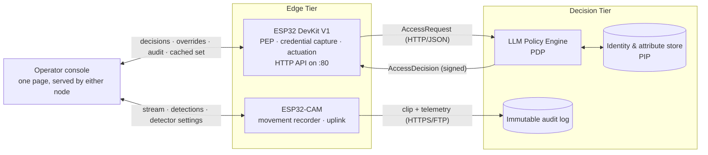
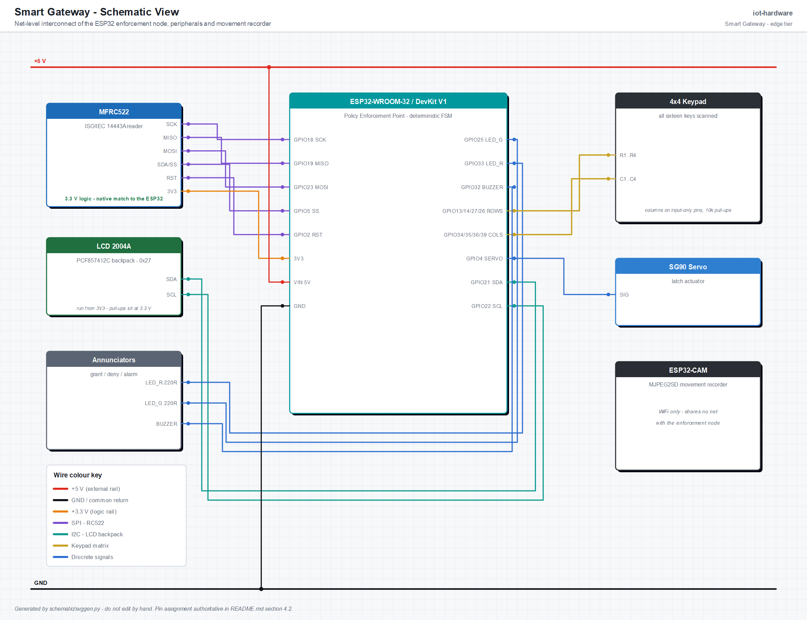
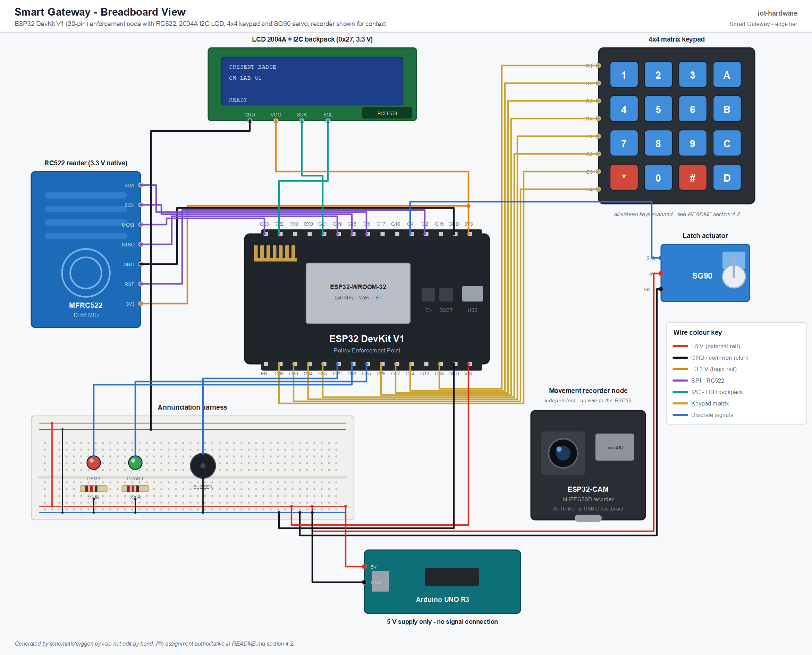
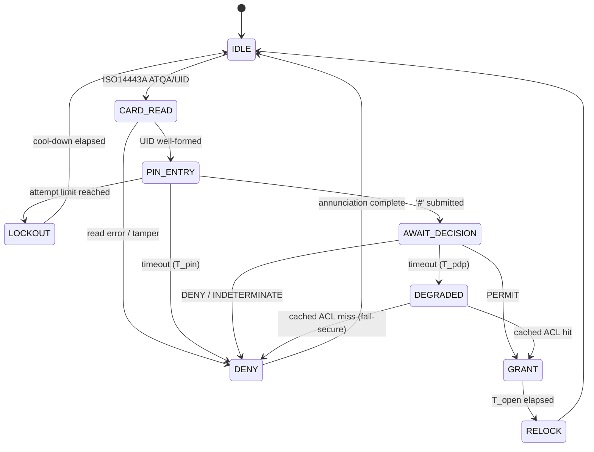

# Smart Gateway ESP32 Hardware in Movement Attestation
---

## 1. Abstract

This repository contains the **edge tier** of a two-tier smart-workplace access control system. The system governs the physical movement of employees through a company's controlled portals (main entrance, floor doors, restricted laboratories) by combining conventional credential capture with continuous visual attestation of the transit event.

The architecture separates *decision* from *enforcement*, following the reference model established by NIST SP 800-162 for Attribute-Based Access Control (ABAC) [1] and the XACML functional decomposition [2]:

- The **Policy Decision Point (PDP)**, an LLM-mediated rule engine that evaluates natural-language organisational policy against structured request attributes.
- The **Policy Enforcement Point (PEP)**, the **Policy Information Point (PIP)** and the **movement recording subsystem**.
Concretely, this repository implements a **laboratory-scale mini gateway**: an **ESP32 DevKit V1** node performing multi-factor credential capture (RFID + PIN) and electromechanical actuation, coupled to an ESP32-CAM node performing event-triggered motion recording, derived from the `ESP32-CAM_MJPEG2SD` firmware [3]. The RC522/LCD/servo wiring follows the ESP32 door-access reference of Robotique Site [6], with its companion video walkthrough [8]; the keypad, annunciator and PIN logic are carried over from the BanLinhKien RC522 door-lock kit project [4]. Both references are stand-alone hard-coded locks, and both are extended here into a single network-attached, policy-governed, auditable enforcement node.

> [!CAUTION]
> **Credential strength.** An RC522 UID is an *identifier*, not a *secret*: MIFARE Classic UIDs are trivially cloned, and the Crypto-1 cipher has been broken in the open literature since 2008 [5]. The PIN factor and the visual attestation exist precisely because the card carries no weight on its own. Any field deployment requires cryptographic card authentication (DESFire EV2/EV3 or equivalent).

---

## 2. Project Structure

```
iot-hardware/
├── firmware/
│   ├── gateway-esp32/                   # Enforcement node (FSM, RC522, keypad, LCD, servo)
│   └── esp32cam/                        # Integration layer over ESP32-CAM_MJPEG2SD
├── console/                             # Operator console (one page, both nodes)
├── schematic/                           # EAGLE sheet + breadboard/schematic generator
├── protocol/
├── docs/
└── tools/
```
---

## 3. System Context



The division of responsibility is deliberate and strict:

| Concern | Tier | Rationale |
|---|---|---|
| Credential acquisition (UID, PIN) | Edge | Requires physical proximity to the transducer |
| Liveness / movement evidence | Edge | Bandwidth-prohibitive to stream continuously |
| Identity resolution | Decision | Requires the authoritative employee directory |
| Policy evaluation | Decision | Rules are expressed in natural language and revised frequently |
| Actuation | Edge | Must remain deterministic and bounded in latency |
| Audit retention | Decision | Must be tamper-evident and outlive the device |

> [!IMPORTANT]
> The edge node **never** stores organisational policy. It holds only a short-lived *cached authorisation set*, bounded in size and TTL, used to sustain degraded operation during a network partition. On any cache miss the node fails **secure** when it denies.

---

## 4. Hardware Realisation

### 4.1 Materials

| Qty | Component | Role |
|---|---|---|
| 1 | ESP32 DevKit V1 (ESP32-WROOM-32, 30-pin) | Enforcement node / credential controller |
| 1 | MFRC522 (RC522) 13.56 MHz reader | ISO/IEC 14443A credential capture |
| 1 | LCD 2004A with PCF8574 I²C backpack [7] | Operator prompt and state display |
| 1 | Arduino UNO R3 (ATmega328P) | **Bench 5 V supply** — see §4.1 |
| 1 | 4×4 matrix membrane keypad | PIN entry (second authentication factor) |
| 4 | 10 kΩ resistors | Pull-ups for the keypad columns — see §4.2 |
| 1 | SG90 micro servo | Latch actuation (bench surrogate for a solenoid strike) |
| 2 | LED, red and green, with 220 Ω series resistors | Denial / grant annunciation |
| 1 | Passive buzzer | Audible denial and tamper alarm |
| 1 | ESP32-CAM (AI-Thinker, OV2640) + microSD | Movement recording and network uplink |
| 1 | USB-C programmer baseboard for the ESP32-CAM | Powers and flashes the recorder — see §4.3 |
| 1 | Breadboard and jumper set | Bench harness |
| 1 | USB supply — host PC on the bench, 5 V USB PSU in service | Feeds the UNO, which feeds the 5 V rail |

> [!WARNING]
> **Power distribution.** The servo's stall current must not be drawn through the DevKit's on-board regulator. It is fed from the 5 V rail directly, with grounds commoned to the ESP32. Omitting this is the single most common cause of spurious resets on this bench.

> [!CAUTION]
> **A USB-powered UNO cannot supply this bench, and the servo is what breaks it.** A host USB port allows 500 mA, and the UNO's own polyfuse is rated the same. The load is not:
>
> | Load | Typical | Worst case |
> |---|---|---|
> | ESP32 DevKit, WiFi transmitting | 120 mA | ~300 mA |
> | SG90 servo, moving → stalled | ~200 mA | **~700 mA** |
> | LCD 2004A with backlight | 30 mA | 40 mA |
> | RC522 | 15 mA | 26 mA |
> | LEDs and buzzer | 20 mA | 45 mA |
> | UNO itself | 45 mA | 50 mA |
> | **Total** | **~430 mA** | **~1.16 A** |
>
> Idle fits; a latch actuation during a WiFi transmit does not. The rail sags, the ESP32 browns out mid-transaction, and the failure looks like random resets on grant rather than like a power problem. Either give the servo its own 5 V ≥ 1 A supply with grounds commoned, or power the UNO from a 7–12 V barrel jack so its regulator sources the rail instead of the USB port — and even then expect the regulator to run hot.

> [!CAUTION]
> **Two power domains, and they never share a 5 V rail.** The enforcement node, the servo and the annunciators run from the UNO's 5 V through `VIN`; the recorder runs from its own USB-C. The domains meet at **ground and nowhere else**.

> [!CAUTION]
> **One supply per board at a time.** The UNO's `5V` header pin sits *downstream* of both the regulator and the USB power-selector MOSFET. With `VIN` unpowered that MOSFET conducts, so the `5V` pin is tied to the USB 5 V line through the board's polyfuse. Feeding an external supply into that pin while the USB cable is plugged in back-feeds the host port, and the polyfuse does not protect in that direction — the usual result is the PC shutting the port down for overcurrent. The same applies to the ESP32's `VIN`. Unplug one before connecting the other.

### 4.2 Pin Assignment (ESP32 DevKit V1)

The RC522 and LCD assignments are taken verbatim from the Robotique Site ESP32 reference [6] and retained for interoperability with it. The **Silkscreen** column is what is actually printed on the board, and it is not always `Dnn`. Wire against that column, not against the GPIO number.

| Signal | ESP32 GPIO | Silkscreen | Source | Notes |
|---|---|---|---|---|
| RC522 `SDA/SS` | GPIO 5 | `D5` | [6] | VSPI slave select |
| RC522 `RST` | GPIO 2 | `D2` | [6] | Module reset |
| RC522 `SCK / MOSI / MISO` | GPIO 18 / 23 / 19 | `D18` / `D23` / `D19` | [6] | Hardware VSPI |
| RC522 `3.3V`, `GND` | 3V3, GND | `3V3`, `GND` | [6] | Native 3.3 V |
| I²C `SDA` / `SCL` | GPIO 21 / GPIO 22 | `D21` / `D22` | [6] | Shared bus: LCD backpack + recorder |
| Servo signal | GPIO 4 | `D4` | this project | LEDC-driven 50 Hz PWM |
| Keypad rows R1–R4 | GPIO 13, 14, 27, 26 | `D13`, `D14`, `D27`, `D26` | this project | Driven low one row at a time |
| Keypad columns C1–C4 | GPIO 34, 35, 36, 39 | `D34`, `D35`, **`VP`**, **`VN`** | this project | **Input-only** — external 10 kΩ pull-ups required |
| Green LED (grant) | GPIO 25 | `D25` | this project | |
| Red LED (deny) | GPIO 33 | `D33` | this project | |
| Buzzer | GPIO 32 | `D32` | this project | Active-high |
| — | GPIO 17, GPIO 16 | **`TX2`**, `RX2` | — | Left free as spares |

### 4.4 Schematic and Breadboard

The bench wiring is documented in three complementary forms, all under `schematic/`:

| Artefact | Format | Maintained by | Status |
|---|---|---|---|
| `smart-gateway-schematic.svg` / `.png` | SVG / PNG | Generated by `svggen.py` | **Normative** — net-level interconnect |
| `smart-gateway-breadboard.svg` / `.png` | SVG / PNG | Generated by `svggen.py` | Current — physical placement |
| `smart-gateway.sch` | EAGLE 7.3.0 XML | Hand-edited in EAGLE | **Stale** — see below |


**Net-level view.** Every net, with the pin names of §4.2 on both ends:



**Breadboard view.** The same wiring as it sits on the bench:



Regenerate both figures after any change to the pin assignment:

```bash
sh schematic/schematic.sh
```

> [!NOTE]
> `svggen.py` declares the two 15-way DevKit headers once, in the physical order of the board, and every jumper is expressed as an endpoint on one of those pins. A wire routed to a pin that does not exist raises a `KeyError` at generation time rather than producing a plausible-looking but wrong diagram.

> [!NOTE]
> The generated sheets are **schematic-only**: no device carries a package, so they document connectivity and will not generate a board layout. The RC522 `IRQ` line is intentionally left unconnected — the reader is polled, not interrupt-driven.

---

## 5. Firmware Architecture

### 5.1 Enforcement Node (ESP32 DevKit V1)

A deterministic finite-state machine. No dynamic allocation, no blocking network I/O, bounded worst-case path from credential presentation to actuation.



Departures from the reference implementations [4] and [6]:

1. **The card UID and the PIN are no longer authorisation.** In [4] a UID match against a compile-time constant *is* the grant; [6] goes further and toggles the latch open or closed on any card it recognises, so a replayed UID both opens and closes the door. Here both factors are merely *evidence*: they are marshalled into an access request and the grant is issued only by the PDP. The firmware contains no employee credentials, and the latch is edge-driven from the decision, never toggled by the card.
2. **PINs are never transmitted or logged in clear.** The keypad buffer is salted with a per-transaction nonce and hashed; only the digest leaves the node, and the plaintext buffer is zeroised on every state exit.
3. **The display masks input.** Retained from [4]: entered digits render as `*` on the 2004A. Only masked text is ever written to the backpack, so the PIN never appears on the I²C bus.
4. **Every transition emits an audit record**, including denials, timeouts and tamper events — a denial that is never recorded is indistinguishable from an attack that was never attempted.

The node is implemented in `firmware/gateway-esp32/`, and it is **addressable**: it serves an operator page and a JSON API on port 80, which is how the web application reaches it.

| Method | Path | Purpose |
|---|---|---|
| GET | `/api/status` | State, door position, the transaction in flight, counters |
| GET | `/api/events?since=` | The audit ring, newest first |
| POST | `/api/decision` | Answer the transaction the node is blocked on |
| POST | `/api/unlock`, `/api/lock` | Operator override, recorded as such |
| GET/POST | `/api/acl` | Maintain the cached authorisation set |
| POST | `/api/enrol` | Read the next card presented, and authorise nothing by it |
| GET/POST | `/api/config` | Read settings / set one |

Two properties hold the design together, and both are enforced in `access.cpp` rather than documented and hoped for:

- **A decision is bound to a transaction.** `POST /api/decision` names a `txn`, and anything that does not name the one currently in flight is refused with `409`. Without that binding the endpoint is an unlock button that happens to take an argument, and a captured permit replays into the next person's transaction.
- **The path a decision arrived by does not change how it is treated.** The PDP's reply and an operator's click land in the same inbox, take the same HMAC check against `decisionKey`, and produce the same audit record — one that records whether the decision was signed.

> [!IMPORTANT]
> Every mutating route requires an API token, minted on first boot and printed once on the serial console. Clearing it puts the node in bench mode, where `/api/unlock` answers anyone who can reach port 80. Full protocol in [`firmware/gateway-esp32/README.md`](firmware/gateway-esp32/README.md).

### 5.2 Movement Recorder (ESP32-CAM)

Built on `ESP32-CAM_MJPEG2SD` [3], which supplies the frame pipeline, AVI muxing to SD, MJPEG/RTSP streaming, MQTT publication and time-stamped foldering. This project supplies a thin integration layer above it:

- **Motion-triggered capture.** The recorder opens a clip on its own detection; there is no trigger line from the enforcement node (§4.3). A configurable pre-roll (retained frame ring) and post-roll bracket the event, so the clip contains the approach and the departure rather than only the moment the detector fired.
- **Secondary camera-side motion detection.** The frame-differencing detector of [3] — which compares successive downscaled greyscale bitmaps — runs continuously. A movement detection *without* a corresponding credential event is itself a reportable condition: it is the signature of tailgating, of an unbadged transit, or of a propped door.
- **Correlation.** Each clip is named and tagged with the epoch at which it opened. The join to a credential event happens in the console (§5.3), not on the node — the recorder never learns that a badge was presented.
- **Uplink.** Clips traverse HTTPS or FTP to the retention store, using the transports already implemented in [3]. Access requests and decisions are not the recorder's traffic — the enforcement node carries those itself (§3).

> [!NOTE]
> **Prerequisites.** Arduino IDE ≥ 2.x or `arduino-cli`. For the enforcement node: ESP32 board support ≥ 2.0.x, board *DOIT ESP32 DEVKIT V1*; libraries `MFRC522` and `ESP32Servo` (the AVR `Servo` library used by [4] does not build for the ESP32 — `ESP32Servo` drives the SG90 through the LEDC peripheral instead). `Keypad` and `LiquidCrystal_I2C` are deliberately **not** used: both block for milliseconds at a time, and the enforcement loop has to stay bounded, so the matrix scan and the HD44780 timing live in `panel.cpp` where the waits can be spread across ticks. Plus the upstream `ESP32-CAM_MJPEG2SD` sources [3].

1. **Wire and verify power** before connecting the RC522 — confirm 3.3 V at the module, and confirm the servo is on the 5 V rail while the camera runs from its own USB-C. Check the four keypad-column pull-ups are fitted (§4.2); without them the matrix scan reads garbage rather than failing outright. Confirm that **no** wire runs from the external rail to the Arduino's `5V` pin (§4.1).
2. **Flash the enforcement node.** Bring it up with the local PDP stub (`tools/pdp-stub`) so that the door logic can be exercised without the decision tier.
3. **Flash and provision the recorder.** On first boot the ESP32-CAM raises its own access point at `192.168.4.1`, where WiFi credentials, resolution, frame rate and motion sensitivity are configured [3].
4. **Verify both clocks agree.** With the recorder provisioned, confirm each node reports a sane epoch and that the console's Timeline tab correlates rather than reporting the join unavailable (§4.3). Wave at the camera and confirm a clip is written to SD with the expected pre-roll.
5. **Point the recorder at the real PDP** and confirm signature verification, including a deliberate negative test with a bad signature.

### 5.3 Operator Console

One page, `console/index.html`, embedded into **both** firmwares by
`console/build.py` and served at `/` by each of them. Point a browser at either
node and the interface is the same; it probes the origin it was served from to
work out which node answered, and the other node's address is entered once and
kept in the browser. Neither node is a dependency of the other — with one
unreachable, the console runs with that half greyed out.

| Tab | Node | Contents |
|---|---|---|
| Door | Enforcement | State, the transaction awaiting a decision, override, audit ring, cached authorisation set, card enrolment |
| Camera | Recorder | Live MJPEG with the motion mask overlaid, detections and their ground-truth labels, the three detector stages |
| Timeline | Both | Credential events joined to motion events |
| Setup | Both | Node addresses and token, enforcement settings, WiFi for either node |

> [!NOTE]
> **Why one page rather than two.** §5.4 classifies a transit by what *both*
> nodes saw, and neither node can perform that classification: the enforcement
> node cannot see movement and the recorder cannot see a credential. Two
> separate interfaces put the join in the operator's head. The Timeline tab does
> it in the browser, which is the first place in the system where both halves of
> the evidence are present at once.

The join is on the epoch, and both nodes report one. When either clock is unset
the tab says the correlation is unavailable rather than lining up two stopwatches
started at different moments and presenting the result as evidence.

The console is a normal static page — it is also openable straight off disk, or
from any static host, and reaches the nodes over their JSON APIs. Both nodes send
`Access-Control-Allow-Origin` for that reason; the enforcement node's API token,
not the page's origin, is what gates the door.

To work on the page without flashing anything, serve the directory and open
**http://localhost:8000**:

```bash
python -m http.server 8000 --directory console
```

Nothing is fetched from a CDN, so this needs no build step and no network. With
no node reachable the page loads and reports both halves as absent, which is
enough to work on layout; point it at real hardware from *Setup → Nodes*.
Opening the file directly works too — `Access-Control-Allow-Origin: *` covers
the null origin a `file://` page carries — but the page cannot probe an origin
it does not have, so both addresses have to be typed in rather than one of them
being filled in for you.

> [!IMPORTANT]
> `console_ui.h` in each firmware directory is **generated**. Edit
> `console/index.html` and re-run `python console/build.py`; a change made to
> either header is lost the next time anyone does.

### 5.4 Movement Semantics

The system distinguishes three observable classes, only the first of which is a normal transit.

| Class | Credential event | Motion event | Interpretation |
|---|---|---|---|
| 1 — Attested transit | present | present | Nominal |
| 2 — Unattested motion | absent | present | Tailgating / propped door / intrusion |
| 3 — Unconsummated grant | present | absent | Credential probing, or a granted user who did not enter |

> [!IMPORTANT]
> Classes 2 and 3 are escalated to the decision tier as anomalies rather than being discarded at the edge. An access system that observes only successful transits is blind to precisely the events worth observing.

---

## References

[1] V. C. Hu *et al.*, *Guide to Attribute Based Access Control (ABAC) Definition and Considerations*, NIST Special Publication 800-162, National Institute of Standards and Technology, 2014.

[2] OASIS, *eXtensible Access Control Markup Language (XACML) Version 3.0*, OASIS Standard, 2013.

[3] s60sc, *ESP32-CAM_MJPEG2SD* — ESP32/ESP32-S3 camera application recording MJPEG frames to SD as AVI, with motion detection, streaming, telemetry and MQTT. https://github.com/s60sc/ESP32-CAM_MJPEG2SD

[4] BanLinhKien, *BLKLab PRJ14 — RFID door lock with Arduino UNO R3*, Arduino learning-kit reference project. https://github.com/BanLinhKien/Arduino/blob/main/2_Bo_KIT_Hoc_Tap_Arduino_Uno_R3_RFID_BLK/BLKLab_PRJ14_Cach_Lam_Khoa_Cua_RFID_Bang_Arduino/BLKLab_PRJ14_Cach_Lam_Khoa_Cua_RFID_Bang_Arduino.ino

[5] F. D. Garcia *et al.*, "Dismantling MIFARE Classic," in *Proc. 13th European Symposium on Research in Computer Security (ESORICS)*, LNCS 5283, Springer, 2008, pp. 97–114.

[6] M. A. Haj Salah, *Smart door access control using ESP32 and RFID card*, Robotique Site. Source of the RC522 and LCD pin assignment used in §4.2. https://www.robotique.site/tutorial/smart-door-access-control-using-esp32-and-rfid-card

[7] VDRAM, *Module LCD 20x4 I²C pour Arduino, rétroéclairage bleu* (WPI450) — 20×4 character LCD with PCF8574 backpack, 5 VDC, I²C address 0x20–0x27 (default 0x27). https://www.vdram.com/interfaces-compatibles-arduino/1934-module-lcd-20x4-ic-pour-arduino-retroeclairage-bleu-wpi450.html

[8] Robotique Site, *Smart door access control using Arduino and RFID card* — video walkthrough accompanying [6]. https://youtu.be/AbjD1DNPrNs